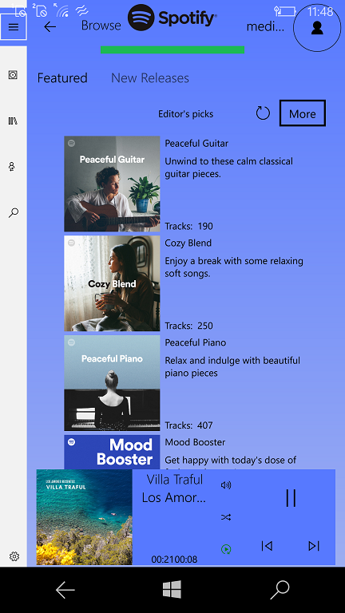

# Spotify for Win10Mobile

"Boxify" (Spotify for XBox One) fork

Proof-of-concept (plays only 30 sec of each song...)

## My 2 cents
* English translation of app UI
* Project extension scheme

## Screenshots

# Contribute!
There's still a TON of things missing from this proof-of-concept (MVP) and areas of improvement 

With best wishes,

  [m][e] 2021

## Thanks!
I wanted to put down some thank you's here for folks/projects/websites that were invaluable for helping me get this project into a functional state:
- [Adam Boe](https://github.com/aboe026/) - Spotify for XBox One developer / creator
- [Boxify](https://github.com/aboe026/boxify/) - Original Spotify Client (UWP, for XBox One)

Spotify 1.0.0.0 is RnD project only. AS-IS. No support. Distributed under the MIT License.  